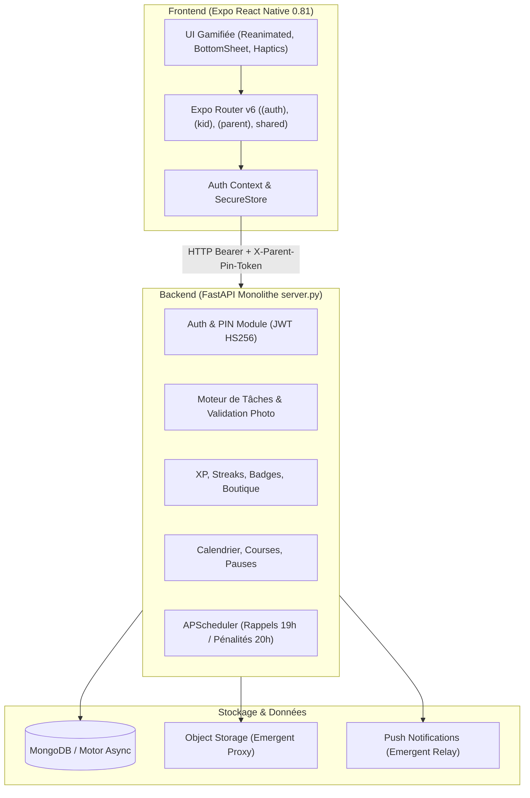

# Architecture & Rapport d'Audit Technique — TribuQuest (TâcheHéros)

**Date d'audit :** 28 août 2026  
**Auteur :** Agent Orchestrateur Principal  
**Projet :** Application mobile de gamification des corvées et de l'organisation familiale  

---

## 1. Synthèse de l'Existant

Le projet **TribuQuest (TâcheHéros)** est une application mobile cross-platform (iOS, Android, Web) inspirée de la gamification style *Duolingo* (points XP, flammes de séries/streaks, classements podiums, boutique de récompenses, quêtes quotidiennes et défis de famille).



---

## 2. Cartographie Technique de la Stack

### 2.1 Frontend (Mobile & Web)
* **Framework :** React Native `0.81.5`, React `19.1.0`, Expo SDK `54.0.36`.
* **Routage :** `expo-router` `6.0.24` (routage basé sur le système de fichiers, groupes logiques `(auth)`, `(kid)`, `(parent)`, `shared`).
* **Gestion d'état :** React Context basique (`AuthProvider`) + `useState` local avec rafraîchissement au focus (`useFocusEffect`). *(Absence de store global unifié et de cache réseau).*
* **Design & Animations :** Palette tactile (Vert `#58CC02`, Orange `#FF9600`, Or `#FFC800`, Rouge `#FF4B4B`), `react-native-reanimated` `4.1.1`, `react-native-gesture-handler` `2.28.0`, `@gorhom/bottom-sheet` `5.2.14`, `expo-haptics`, `expo-image`.
* **Matériel & Capteurs :** `expo-camera`, `expo-image-picker`, `expo-notifications`, `expo-audio`, `@react-native-community/datetimepicker`.
* **Stockage Sécurisé :** `expo-secure-store` (natif) avec fallback `AsyncStorage` (web).

### 2.2 Backend
* **Framework Web :** FastAPI `0.110.1` (Python 3.10+ / 3.14 compatible, Uvicorn, Starlette).
* **Persistance :** MongoDB via le pilote asynchrone `motor` `3.3.1` (avec émulation `mongomock_motor` pour l'exécution isolée).
* **Sécurité & Cryptographie :** `PyJWT` (tokens Bearer 7 jours + tokens temporaires de PIN parent), `pwdlib`/`passlib` (hachage de mot de passe et du code PIN 4 chiffres).
* **Moteur Asynchrone & Cron :** `APScheduler` (exécute à 19h00 les rappels et à 20h00 le calcul des pénalités/streaks perdus).
* **Tests Automatisés :** Pytest (`backend/tests/`) avec couverture des scénarios d'authentification, de régression, d'isolation des familles et d'idempotence des pénalités.

---

## 3. Audit de la Dette Technique et Code Généré par Emergent

L'analyse approfondie du code source a permis d'identifier plusieurs goulots d'étranglement majeurs et dépendances propriétaires générées lors de la phase initiale Emergent :

### 3.1 Dépendances Propriétaires & Verrous Écosystème
1. **Verrouillage sur le Storage Emergent :**  
   Les endpoints d'upload de preuves photos (`POST /api/tasks/{id}/complete` et `GET /api/photos/{path}`) dépendent directement de `https://integrations.emergentagent.com/objstore/api/v1/storage` via des appels `requests` synchrones. Hors de la sandbox Emergent, l'upload échoue systématiquement en erreur 500.
   > **Correction requise :** Créer un adaptateur de stockage abstrait (`StorageService`) supportant le stockage local en dev, AWS S3 / Cloudflare R2 / Supabase Storage en production.
2. **Dépendance Push Notification Propriétaire :**  
   L'envoi des notifications s'effectue via un relai SuprSend Emergent (`_push_client` vers `integrations.emergentagent.com`).
   > **Correction requise :** Migrer vers l'API Expo Push standard (`https://exp.host/--/api/v2/push/send`) ou Firebase Cloud Messaging (FCM).
3. **Scripts de Sandbox / Gardiens de Commandes :**  
   La présence de `frontend/scripts/cmd-guard.js`, `cmd-guard/`, `install-guard.sh` et du hook `preinstall` dans `package.json` est un résidu de conteneur d'Emergent susceptible de bloquer les installations classiques `npm` / `yarn` / `bun` en local ou sur les serveurs de build CI.
   > **Correction requise :** Nettoyer les scripts shims et sécuriser le `package.json`.
4. **Identifiants de bundle génériques :**  
   `com.emergent.tachesenfamille.wlnd8j` dans `app.json`.
   > **Correction requise :** Remplacer par l'identifiant de production souhaité (ex: `com.tribuquest.app`).

### 3.2 Structure du Code & Maintenabilité
1. **Monolithe Backend `server.py` (1351 lignes) :**  
   Toutes les routes, schémas Pydantic, fonctions utilitaires, connexions MongoDB et tâches planifiées sont condensées dans un unique fichier.
   > **Architecture cible :** Découpage en structure modulaire FastAPI propre :
   ```text
   backend/
   ├── app/
   │   ├── core/          # Config, sécurité, JWT, CORS, exceptions
   │   ├── db/            # Client Mongo, initialisation index & seed
   │   ├── models/        # Schémas Pydantic (User, Task, Reward, etc.)
   │   ├── services/      # Logique métier (Storage, Push, Gamification, Penalties)
   │   ├── api/           # Routeurs FastAPI par domaine (auth, tasks, family, rewards, etc.)
   │   └── scheduler/     # Jobs APScheduler (crons 19h, 20h)
   ├── tests/             # Tests unitaires & intégration
   └── main.py            # Point d'entrée de l'application
   ```
2. **Gestion d'état Frontend et Requêtes Répétitives :**  
   Chaque écran appelle `api.get(...)` via `useFocusEffect` sans mise en cache ni gestion de la connectivité réseau. Les erreurs réseau sont silencieusement capturées par `try { ... } catch {}`.
   > **Correction requise :** Intégration de **TanStack Query (React Query)** ou d'un store **Zustand** avec persistance locale pour le cache hors-ligne et la réactivité UI en temps réel.

### 3.3 Sécurité (Conformité OWASP Mobile)
1. **Protection contre la Force Brute sur le PIN Parent :**  
   Le PIN parent comporte 4 chiffres (10 000 combinaisons). Aucun mécanisme de limitation de débit (*Rate Limiting* / *Account Lockout*) n'est présent sur `/api/auth/pin/verify`.
2. **Validation des Fichiers Uploadés :**  
   L'upload d'images se base sur l'extension MIME transmise par le client sans validation stricte des magic bytes (`Pillow` ou `python-magic`) ni limitation de poids (DDoS par upload lourd).
3. **Gestion des Secrets :**  
   Absence de `.env.example` propre et crash serveur au démarrage si une variable d'environnement n'est pas injectée.

---

## 4. Architecture Cible & Feuille de Route

### 4.1 Plan de Refactorisation par Couche

| Domaine | État Actuel | Architecture Cible |
| :--- | :--- | :--- |
| **Backend** | Fichier unique `server.py` | Architecture en couches (Routers, Services, Modèles Pydantic v2, Core) |
| **Stockage Photos** | Proxy Emergent | Provider abstrait (Local Storage pour dev, S3 / Supabase pour prod) |
| **Notifications Push** | Proxy Emergent SuprSend | Service Expo Push direct (`expo-server-sdk` / direct HTTP) |
| **State Frontend** | `useState` + `useFocusEffect` | TanStack Query + Zustand pour l'état global et le cache offline |
| **Gestion d'erreurs** | Blocs `catch {}` vides | Toast Handler centralisé & Retry logic |
| **CI / CD & Build** | Aucun | GitHub Actions (Lint, Test, EAS Build preview / production) |

### 4.2 Organisation des Rôles des Sous-Agents
* 🛠️ **Agent Dev :** Découpage du backend, nettoyage du `package.json`, création du système de stockage universel et standardisation du code React Native.
* 🧪 **Agent QA / Recette :** Création et validation des tests E2E / d'intégration (FastAPI pytest + flux Expo), couverture de non-régression.
* 🛡️ **Agent Sécurité :** Rate-limiting sur les endpoints sensibles (PIN, Auth), validation stricte des uploads, assainissement des tokens et configuration CORS.
* 🚀 **Agent Déploiement :** Configuration `eas.json`, GitHub Actions pour tests automatisés, configuration des métadonnées iOS/Android et préparation des builds de release.
